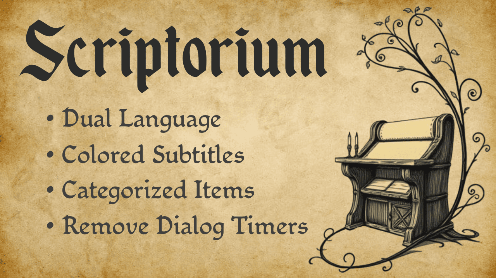

  
  <h1>Scriptorium</h1>

**CLI Toolkit for Kingdom Come: Deliverance I**

Scriptorium is a Node.js command-line toolkit for building a **localization and quality-of-life mod** for **Kingdom Come: Deliverance I**.

It provides a set of customizable utilities to improve the game’s **text**, **accessibility**, and **player experience**. When generating the mod, you can choose which features to enable or skip.

---

## ✨ Features

- **Dual Language Support**
  Display two languages at once for subtitles, dialog options, character names, inventory entries, descriptions, and more.

- **Custom Subtitle Colors**
  Highlight subtitles and dialog options secondary language in a different color for easier reading.

- **Item Categorization**
  Add prefixes to inventory items so they can be grouped when sorted.

- **Remove Dialog Timers**
  Disable time-sensitive dialog options, giving you as much time as you need to make your choice.

---

## 📦 Installation

Scriptorium is fully portable, so no installation required.

There are two builds available:

- **`scriptorium.exe` (~80 MB)**
  A standalone executable with Node.js embedded. Runs out-of-the-box.

- **`scriptorium.cjs` (~0.5 MB)**
  A bundled CommonJS file that requires **Node.js 22+** installed on your system.

💡 **Tip:** Place and run Scriptorium in its own folder. This folder will be used to store:

- `scriptorium-settings.json`: auto-generated config file with your setup options.
- `Scriptorium/*`: the mod folder containing all generated mod files.

---

## ▶️ Usage

1.  Run `scriptorium.exe` or `node scriptorium.cjs`.
2.  Configure Scriptorium
    - Set your preferred CLI language.
    - Set the path to your _Kingdom Come: Deliverance I_ installation folder.
3.  Select which features you want to enable.
    - ⚠️ If language files are involved, Scriptorium will output which in-game language to select so the mod works correctly.
4.  Install and run the mod
    - Move the generated `Scriptorium` folder into the game’s `Mods` directory (create it if the folder doesn’t exist).
    - If applicable, launch the game and select the corresponding in-game language.

---

## ⚠️ Compatibility & Limitations

- **Partial Translation**
  This mod does **not** provide complete translations. Some texts cannot be dual-rendered due to technical limitations, including UI wrappers, spacing/overflow issues, untranslated official text, or untested files.

- **Language Support**
  Dual language can be applied to **any language paired with English**, with configurable order (e.g., _English–Spanish_ or _Spanish–English_). After building the mod, Scriptorium will indicate which in-game language to select.

- **Tested Languages and Known Issues**
  The mod has been **moderately tested** for **English ↔ Spanish**. Other Latin-based languages should work similarly, but Asian languages (Japanese, Chinese, Korean, etc.) have not been tested.

  Note that when using dual language, some texts may appear overlapped or misaligned. Please report any issues so they can be addressed where possible.
